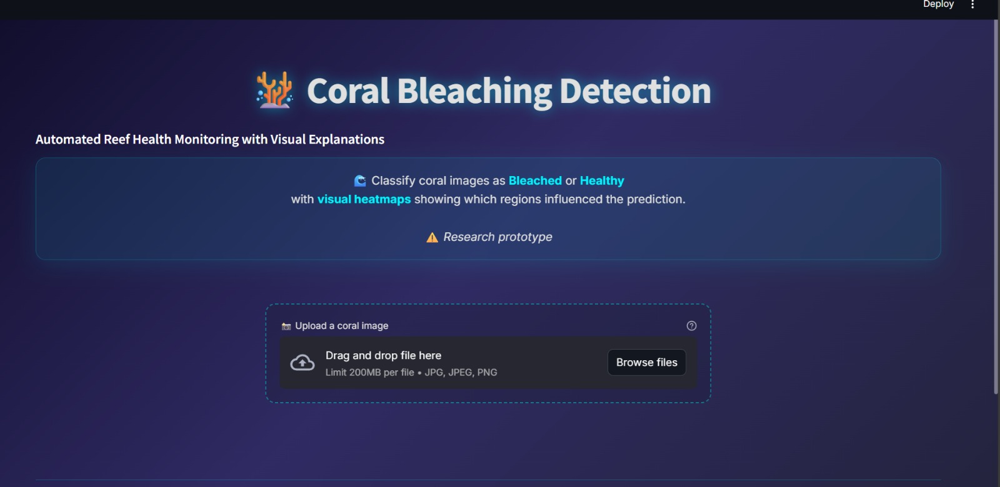

# 🪸 Coral Bleaching Detection

A Streamlit web application for automated coral health monitoring using deep learning and visual explanations.

[](https://coral-bleaching-detection.streamlit.app/)

## 🌐 Live Demo

**Try it now:** [https://coral-bleaching-detection.streamlit.app/](https://coral-bleaching-detection.streamlit.app/)



## 📋 Overview

This application helps marine researchers and conservationists monitor coral reef health by:
- Classifying coral images as **Bleached** or **Healthy** using a ResNet50 deep learning model
- Providing **visual explanations** through Grad-CAM heatmaps showing which regions influenced the prediction
- Offering **confidence scores** to assess prediction reliability

## ✨ Features

- 🖼️ **Image Upload**: Easy drag-and-drop interface for coral images
- 🔍 **Binary Classification**: Identifies coral as Bleached or Healthy
- 📊 **Confidence Scores**: Shows prediction confidence and class probabilities
- 🔥 **Grad-CAM Visualization**: Heatmap overlay showing important image regions
- 🎨 **Modern UI**: Clean, responsive interface with beautiful dark theme
- ☁️ **Cloud Deployed**: Accessible anywhere via web browser

## 🚀 Installation

### Quick Start (Online)

No installation needed! Visit the live app: [https://coral-bleaching-detection.streamlit.app/](https://coral-bleaching-detection.streamlit.app/)

### Prerequisites

For local installation:
- Python 3.8 or higher
- pip package manager

### Setup

1. Clone the repository:
```bash
git clone https://github.com/yourusername/coral-bleaching-detection.git
cd coral-bleaching-detection
```

2. Create a virtual environment (recommended):
```bash
python -m venv venv

# On Windows
venv\Scripts\activate

# On macOS/Linux
source venv/bin/activate
```

3. Install dependencies:
```bash
pip install -r requirements.txt
```

4. Run the application:
```bash
streamlit run app.py
```

The app will open in your default browser at `http://localhost:8501`

## 📦 Requirements

- streamlit
- torch
- torchvision
- Pillow
- numpy
- pytorch-grad-cam

See `requirements.txt` for specific versions.

## 🎯 Usage

1. **Upload Image**: Click "Browse files" or drag and drop a coral image (JPG, JPEG, or PNG)
2. **Analyze**: Click the "🔍 Analyze Coral Health" button
3. **View Results**: 
   - See the prediction (Bleached/Healthy)
   - Check confidence score and probabilities
   - View Grad-CAM heatmap visualization

## 🧠 Model

The application uses a **ResNet50** architecture pretrained and fine-tuned for coral bleaching detection. The model file is stored using **Git LFS** for efficient version control.

### Grad-CAM

Gradient-weighted Class Activation Mapping (Grad-CAM) provides visual explanations by highlighting the regions in the input image that were most important for the model's prediction.

## 📁 Project Structure

```
coral_streamlit_app/
├── app.py                              # Main Streamlit application
├── utils.py                            # Helper functions (model loading, prediction, Grad-CAM)
├── requirements.txt                    # Python dependencies
├── packages.txt                        # System dependencies for deployment
├── coral_bleaching_resnet50_v1_1.pth  # Trained model weights
├── screenshots/                        # Application screenshots
│   └── image.png
├── .gitignore                          # Git ignore file
├── .gitattributes                      # Git LFS configuration
└── README.md                           # This file
```

## 🚀 Deployment

This app is deployed on **Streamlit Cloud** and uses:
- Git LFS for large model file storage
- System packages (libgl1-mesa-glx, libglib2.0-0) for OpenCV support
- opencv-python-headless for server compatibility

## ⚠️ Disclaimer

This is a **research prototype** for educational and research purposes. Predictions should not be used as the sole basis for critical decisions regarding coral reef conservation without expert validation.

## 🤝 Contributing

Contributions are welcome! Please feel free to submit a Pull Request.

## 📄 License

This project is open source and available under the MIT License.

## 🌊 Acknowledgments

- ResNet50 architecture from PyTorch
- Grad-CAM implementation from pytorch-grad-cam
- Streamlit for the web framework
- Deployed on Streamlit Community Cloud

---

**Built with ❤️ for coral reef conservation | [View Live Demo](https://coral-bleaching-detection.streamlit.app/)**
